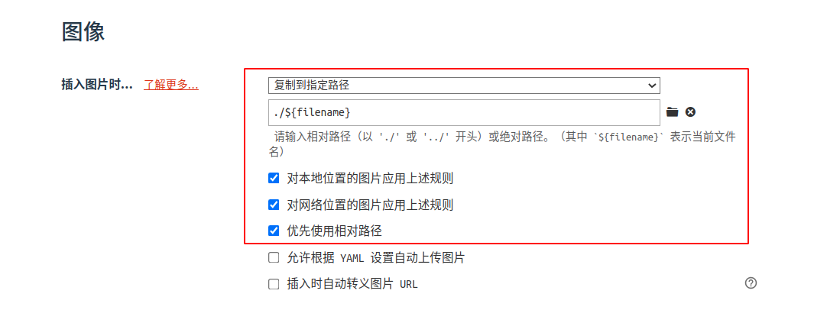
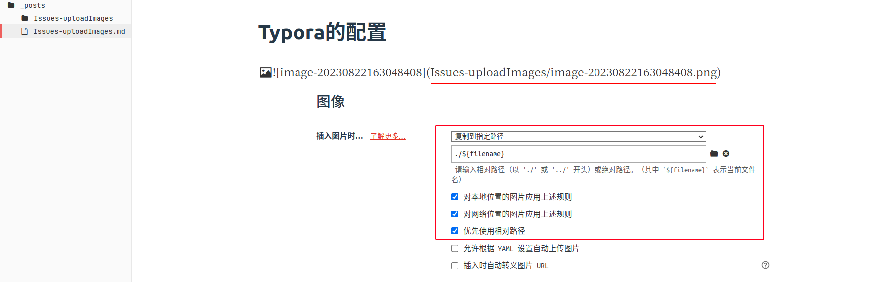
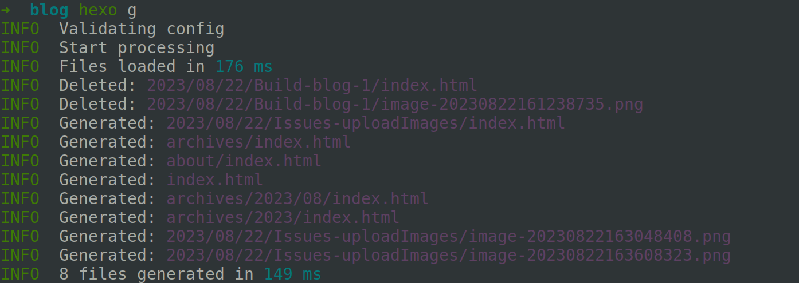
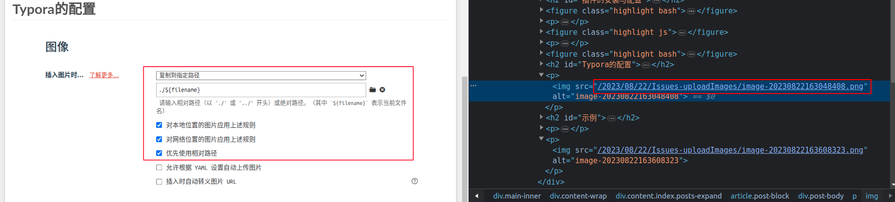

hexo插件+Typora实现图片文件重命名并自动上传

<!--more-->

## 环境

- Ubuntu20.04
- hexo@6.3.0
- hexo-renderer-marked@6.1.1

## 配置文件

`_config.yml`

站点目录下为**<span style="background-color: yellow;">站点配置文件</span>**

主题目录下为**<span style="background-color: #B0E0E6; padding: 2px;">主题配置文件</span>**

## 插件的安装与配置

```bash
npm install hexo-renderer-marked --save
```

参考[Issue](https://github.com/hexojs/hexo-renderer-marked/issues/216)修改`node_modules/hexo-render-marked/lib/render.js`(***之间为修改部分)

```js
    if (!/^(#|\/\/|http(s)?:)/.test(href) && !relative_link && prependRoot) {
      if (!href.startsWith('/') && !href.startsWith('\\') && postPath) {
        const PostAsset = hexo.model('PostAsset');
        // findById requires forward slash
        // ************************************************************
        const pp = require('path');
        const ppp = pp.join(postPath, '../');
        // const asset = PostAsset.findById(join(postPath, href.replace(/\\/g, '/')));
        const asset = PostAsset.findById(join(ppp, href.replace(/\\/g, '/')));
        // ************************************************************
        // asset.path is backward slash in Windows
        if (asset) href = asset.path.replace(/\\/g, '/');
      }
      href = url_for.call(hexo, href);
    }
```

参照[官方文档](https://hexo.io/zh-cn/docs/asset-folders.html)修改**<span style="background-color: yellow;">站点配置文件</span>**

```bash
post_asset_folder: true
marked:
  prependRoot: true
  postAsset: true
```

## Typora的配置



## 示例

使用`hexo g`即可在浏览器中查看修改后可正常访问的路径







## 补充

使用缩放之后图片路径会改变成html直接引用的形式，进而导致路径解析失败

[参考博客](http://songpengpeng.com/2022/05/09/%E6%97%A5%E5%B8%B8%E8%BE%93%E5%87%BA/07-Hexo%E7%9A%84%E6%9C%AC%E5%9C%B0%E5%9B%BE%E7%89%87%E9%97%AE%E9%A2%98/#:~:text=%E8%80%8C%E6%AD%A3%E7%A1%AE%E7%9A%84%E5%9B%BE%E7%89%87%E8%B7%AF%E5%BE%84%E5%9C%B0%E5%9D%80%E6%98%AF%3A,http%3A%2F%2Flocalhost%3A4000%2F2022%2F05%2F09%2F%E6%97%A5%E5%B8%B8%E8%BE%93%E5%87%BA%2F07-Hexo%E7%9A%84%E6%9C%AC%E5%9C%B0%E5%9B%BE%E7%89%87%E9%97%AE%E9%A2%98%2Fimage-20220509205853438.png)修改` themes\next\source\js\next-boot.js`文件

```js
var images = document.getElementsByTagName("img");
var loHref = window.location.href
let baseHref = loHref.substring(0,loHref.lastIndexOf("/")+1)
for (let i = 0; i <images.length; i++) {
    let executeNum = 0;
    let src = images[i]['src']
    let img = new Image();
    img.src = src
    img.onload= ()=> {
    }
    img.onerror= ()=> {
        executeNum ++ ;
        handAMark(src)
        if(executeNum>3){
            return;
        }
        let fileName = src.substring(src.lastIndexOf("/")+1);
        images[i].src= baseHref+fileName
    }
}


function  handAMark(src){
    var as = document.getElementsByClassName("fancybox");
    for (let i = 0; i <as.length; i++) {
        let executeNum = 0;
        let href = as[i]['href']
        if(href==src){
            let img = new Image();
            img.src = src

            img.onload= ()=> {
            }
            img.onerror= ()=> {
                executeNum ++ ;
                if(executeNum>3){
                    return;
                }
                let fileName = src.substring(src.lastIndexOf("/")+1);
                as[i].href= baseHref+fileName
            }
        }

    }

}
```


