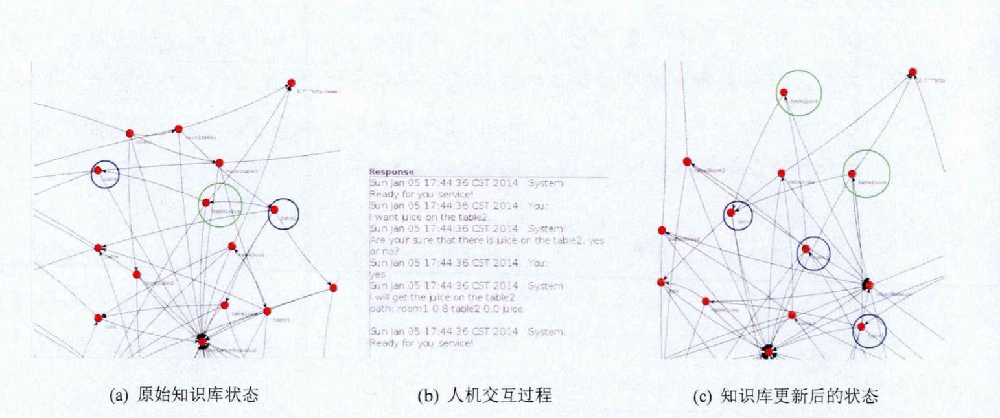
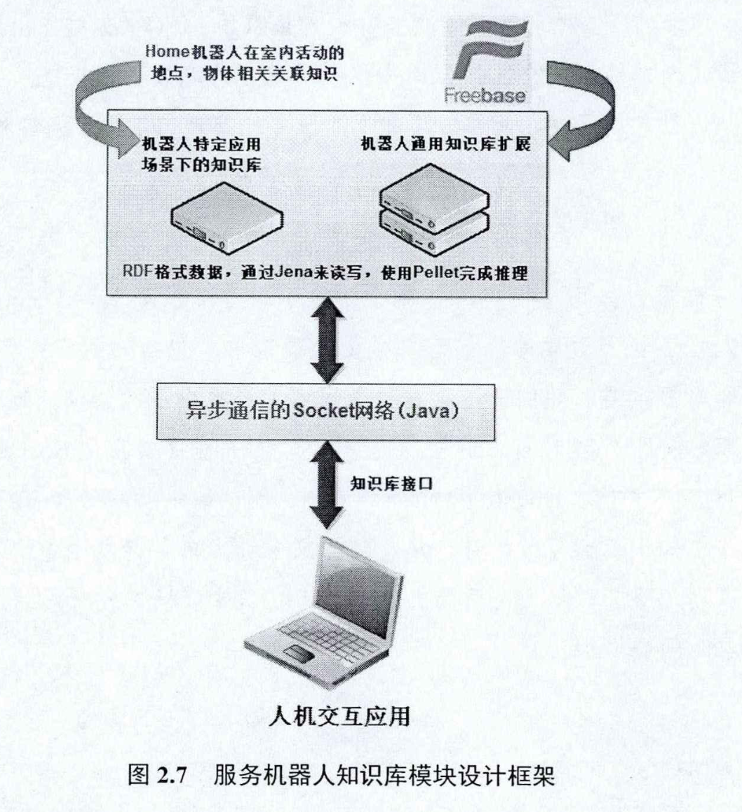
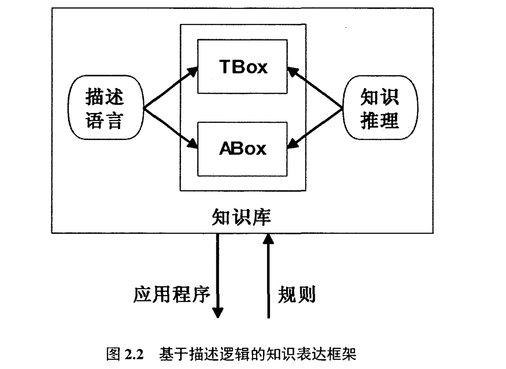
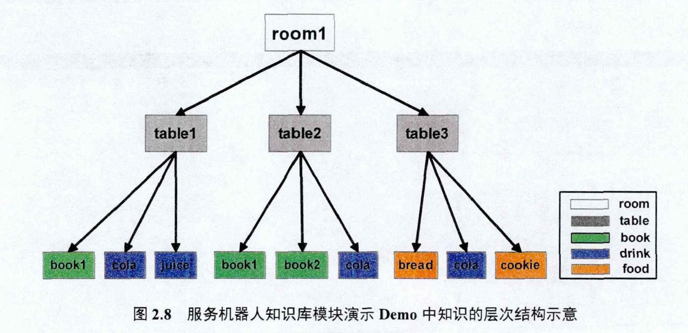
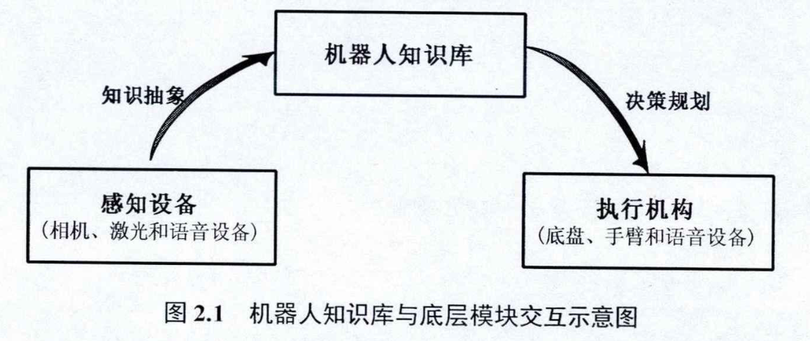

# 服务机器人的知识表达和智能推理

工业机器人-结构化环境

不能把每个场景每个时刻的动作定义好

在具体场景下根据自身推理产生动作执行指令

知识库的定义没有标准形式-在该基础上要实现知识库更新规则

1、定义机器人知识库

- 使用抽象和符号化的知识片段推动作的因果和参数
- 能将现实数据抽象成知识库片段

2、基于描述逻辑语言OWL

- TBox是概念（特定应用的词汇），ABox是实例断言（上述词汇范围内）

- 建模角度：类别和实例

3、基于本体的多层机器人知识框架

类别：感知—建模—运动—上下文

- 上层：机器人和人通用
- 中层：通用抽象
- 底层：感知运动

4、知识库变种

涉及物体与地点的概率模型（看到杯子判断在厨房的概率）

- 从底层到上层的符号抽象表示

  

- 空间属性（形状、尺寸），语义类型（房间、办公室）

- 能被人类分辨的空间块

是否能跟人机结合？

自然语言是非结构化的数据，针对服务机器人在生活环境中需要具有理解人类自然语言的能力， 探索了基于知识 库的服务机器人自然语言理解与智能推理框架， 给出了从处理自然语言到结构化知 识库搜索的整个流程， 解决了非结构化自然语言与结构化机器人知识库之间的交互问题