# MS-Fusion

## 基于多源神经信号融合的人体意图识别

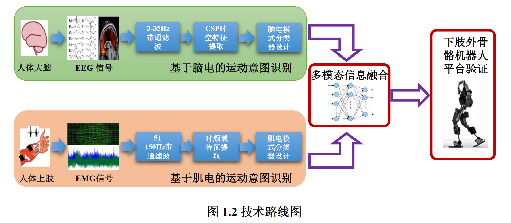

**现有问题与研究方案**

- 人体运动意图估计`难以达到准确有效且实时`的状态，单一模态的传感信号无法同时满足准确性、鲁棒性与全局性的控制要求，实现多信号融合的连续实时控制方面仍存在较大的研究空间

- 传统控制策略中采集方便、对神经信号鲁棒性强的物理传感信号存在`消息传递滞后、信息全局性弱`等缺陷

1. 基于多模态神经信号的意图识别
2. 采用全局性强、无滞后的EEG和准确性高亦无滞后的sEMG

**~~多源信号怎么融合~~这里应该是针对多通道肌电信号特征选择的优化**

- 采用基于 `ReliefF启发式`算法的肌电通道与时域特征选择优化策略

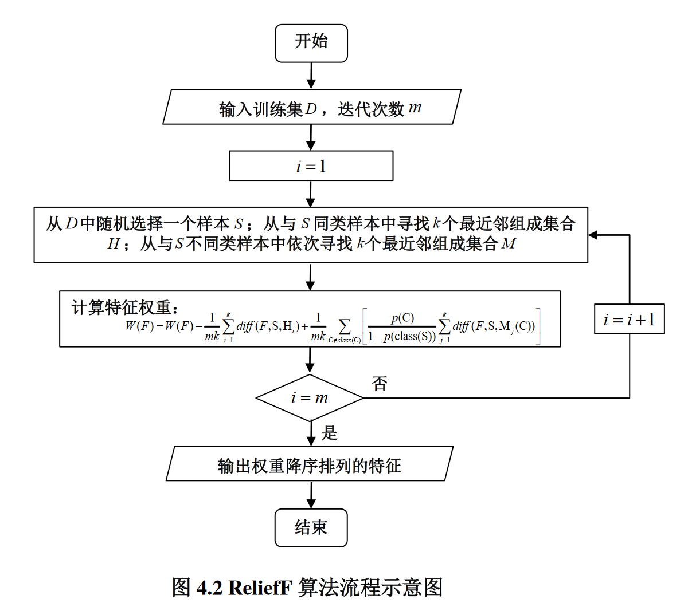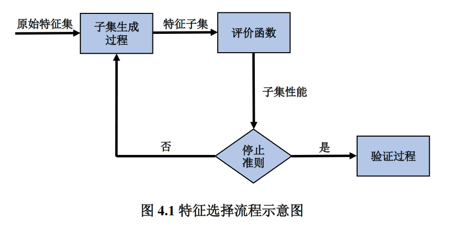

- 目的是为从原始特征集合中滤除信息冗余或相关性低的可分性能较差的特征，从而获取具有最优分类性能与泛化能力的分类器模型

**多源信号怎么融合，融合完进行意图识别**

- 现有脑电信号解码算法的可靠性与鲁棒性尚有待提高，提出一种基于岭回归（Ridge Regression, RR）算法的脑电信号解码方法

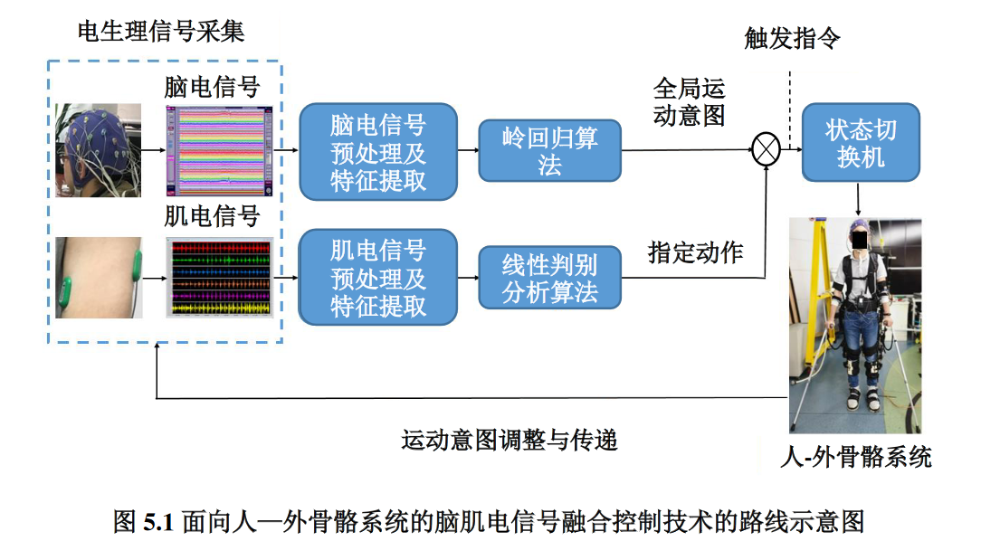

- 任务级融合：
  - 基于脑电的门控系统：运动意图区分为行走或停止，提供了与特定任务相关的高级控制命令来触发机器人执行运动任务
  - 基于sEMG的控制系统：瞬时sEMG分类结果区分运动步幅，完成具体肢体动作

**展望**

- 脑肌电数据库体量小，训练过拟合
- 脑电解码算法需改进，EEG预处理环节可引入独立成分分析等方法
- 没有结合先进的空间滤波算法提取有效特征以进行特征的融合
- 信号的融合策略可扩展为特征级而不是任务级

---

## 基于多源特征融合的人体下肢运动感知方法研究

**现有问题与研究方案**

- 运动数据处理复杂、特征提取不充分
- 特征间存在大量冗余信息、运动模式与步态相位识别预测算法的准确率较低的

1. 构建`IMU+足底压力`采集系统，收集人体下肢在多个运动模式下的步态数据
2. 对多源运动信息进行预处理与数据分析，提取多源运动特征，并基于`多特征选择算法与核主成分分析算法`对提取的多源特征进行选择与融合
3. 通过机器学习的方法对下肢运动模式与步态相位进行识别预测

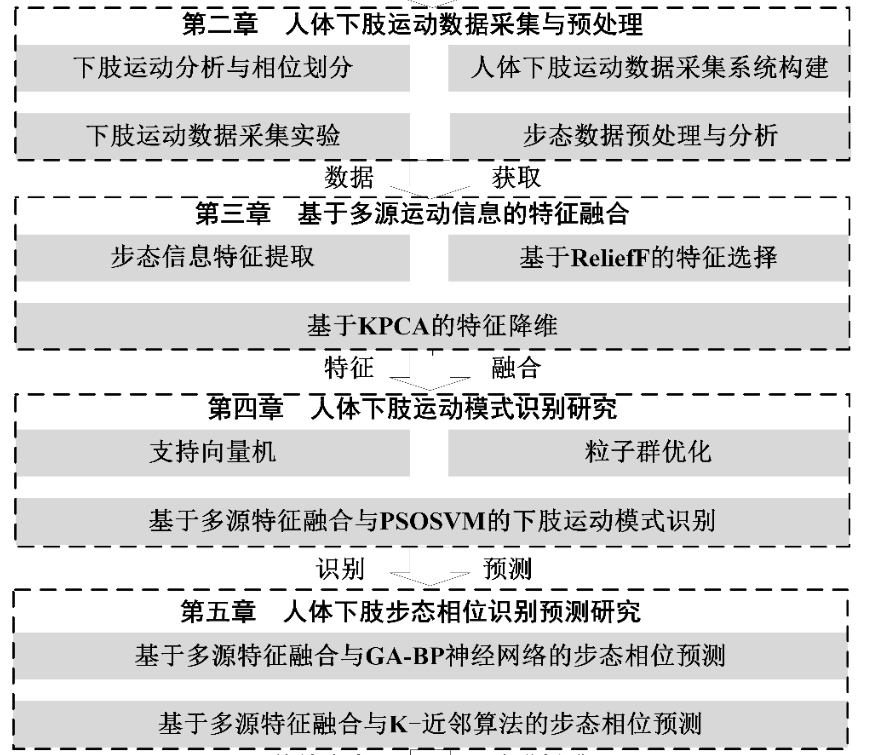

**基于多源运动信息的特征融合**

1. 通过滑动窗口对采集的运动数据进行特征提取，从时域、能量方面得到原始特征
2. 通过 ReliefF多特征选择算法对采集的初步特征进行权重分析，筛选出对分类标签具有较大权重的敏感特征
3. 结合 KPCA 核主成分分析算法去除敏感特征间的冗余信息，得到可以代表原始数据特征的主成分特征向量

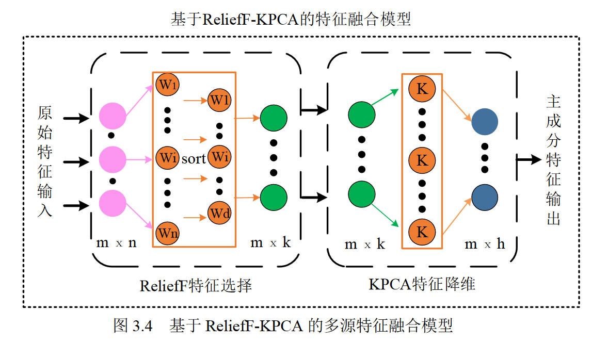

>|                   特征选择（RelifF-KPCA）                    |                       LSTM+注意力机制                        |
>| :----------------------------------------------------------: | :----------------------------------------------------------: |
>| 静态的、信息会损失 | 计算开销、复杂性、可解释性更低 |
>|              减少数据维度，减少模型复杂度和开销              |  动态地根据输入数据的不同部分分配权重，适应不同情况和上下文  |
>|         特征的可解释性更强，因为只选择了最重要的特征         |        STM适用于处理时间序列数据，能够捕捉时间相关性         |
>|              减少了特征的数量，降低了过拟合风险              |                 不需要手动进行特征选择和降维                 |

**搭建基于多源特征融合与PSOSVM（粒子群优化的支持向量机）相结合的下肢运动模式识别模型**

- 粒子群优化算法具有收敛速度快，参数较少的优点，用于解决机器学习中参数寻优的过程

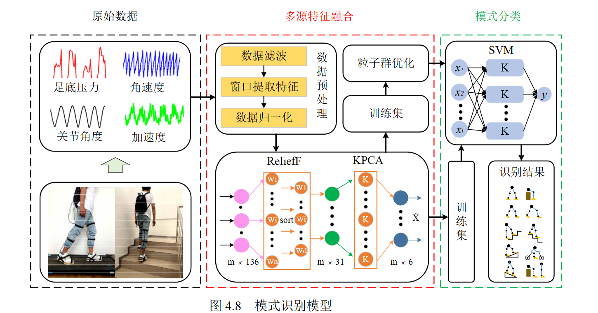

**基于多源特征融合与 GA-BP 神经网络/K-邻近算法的步态相位预测**

模式识别 + 步态相位（基于时间序列）预测 = 外骨骼的`柔顺控制`

既然是基于时间的，这里是不是用LSTM会更好，但是用LSTM怎么解决实时性呢？

**展望**

- SVM对多分类问题存在一定局限性，样本集大的时候效果不好
- 步态相位的预测可以采用基于历史数据预测的模型
- 运动数据采集系统层面可以考虑加入sEMG
- 缺乏实际应用

---

## 基于生物传感的运动意图识别及康复机器人应用

**现有问题和研究方案**

- 脑卒中患者单侧偏瘫行走
- 偏瘫患者下肢康复运动时如何产生有节奏且对称的运动
- 康复训练舒适度

1. 新设计模块化外骨骼

2. 基于关节振动造影信号VGA的运动意图识别

3. 基于多源生物信号-时序卷积网络预测人体运动过程中对侧下肢关节角度

4. 基于导纳控制与比例微分控制的控制器模型

   

---

# sEMG

## 表面肌电人体下肢动作识别预测进展

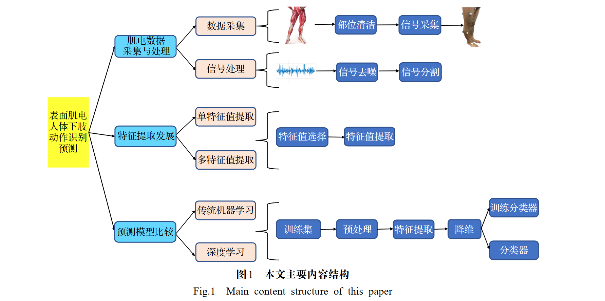

**优势：**

- 表面肌电技术具备非入侵性、无创性，可以较好反映肌肉在人体运动时的发力特征
- 肢体肌肉运动功能的改变使得肌肉收缩产生的肌电信号变化与下肢体动作识别密切相关

**价值：**假肢制造、智能穿戴设备、康复医学以及体育科学等方面

**基于深度学习的表面肌电技术的发展**

1. Jaramillo 等人通过收集不同肌电信号采集装置概述了采集方式对表面肌电动作预测的影响
2. Xiong 等人发现表面肌电的研究和综述仍处于发展初期阶段，相关实验和综述缺少下肢体在肌电信号采集、信号处理、特征提取选择、预测模型分类上的系统 介绍和总结
3. Wang 等人使用自制的肌电采集设备，采样率控制在1000 Hz，选择均方根作为特征值进行下肢动作评估
4. Kuang 等人选择1000Hz采样率的未知肌电设备并基于时域特征下的不同特征向量组成的特征向量空间作为特征提取
5. Zhang 等人[11]采用 FlexComp肌电设备，采样率控制在2000Hz，特征值选择使用均方根

==相关研究在肌电数据采集、信号处理、 特征选择等差异较大 ，且部分方案未指明具体设计原因==

**下肢信号采集、去噪与分割方案**

- 下肢体运动控制的关键部位是股四头肌（股直肌 、股外侧肌 、股内侧肌和股中间肌）

- 使用 3 或 4 通道可以达 90%以上的准确率，逐步增加通道数目往往无法增强识别精确度
- 结合信号滤波与小波去噪等方式可以有效缓解噪声干扰，但原始肌电信号保存着重要的肌肉运动信息与特征，因此信号去噪处理不应过度依赖滤波器
- 下肢肌电信号数据分割时选择滑动窗口，对比验证窗口长度和滑动距离的选择，可以有效提高动作分类准确率
- 实时肌电信号识别预测采用`重叠滑动窗口`的数据处理方式是十分有效的，

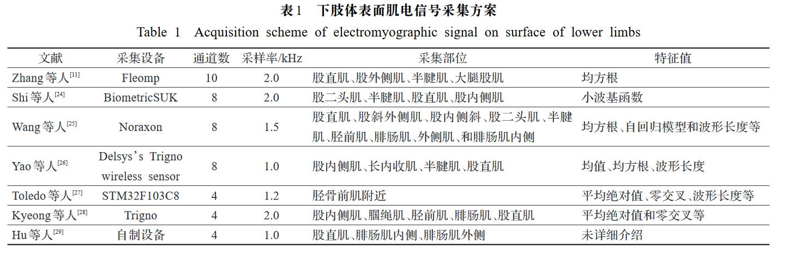

**下肢信号特征提取**

>时域特征：提取方便，可以很好地完成识别，经常作为肌电信号特征值提取的选择方案（抗干扰性差，缺少频段信息）
>
>频域分析：可以很好地解决时域干扰性差等问题，但频域通常由快速傅里叶变化实现（操作复杂）
>
>二者结合为基于时频域分析进行特征提取

单特征值

优点：复杂度低、运算时间短、特征易优化

适用场景：肢体动作简单且运动场景固定

- Samuel等人基于时域提取简单，且在低噪情况下具备较好的分类识别效果 ，选择时域分析中的均方根作为特征提取，平均分类准确率为 92.00% ± 3.11%
- Quraishi等人采用改良的时域特征值提取进行评估，对比传统的时域特征，改良后的时域特征一定程度上提高了稳定性
- Hajian等人直接选择频域分析的中位数频率作为特征提取去克服时域干扰性差问题
- Zhang等人通过时频域分析的小波系数进行踝部肌肉活性判断，结果证明 基于时频域的特征值可以较好判定不同踝部肌肉活性程度
- Tuncer 等人提出了一种基于三元模式和离散小波的迭代特征提取方法。通过采集数据集在KNN分类器进行比较验证，结果显示改进的离散小波迭代特征提取识别效率优于传统特征提取
- She 等人提出了一种基于斯托克韦尔变换 的新时频分析方法，以提高前臂肌电信号的手部运动识别精度，实验结果表明与小波变换和功率谱密度方法相比，所提出的基于斯托克韦尔变换分析方法的特征提取可以有效提高手部运动识别精度

多特征值

优点：更加全面的反应肢体肌肉的运动效果

缺点：特征复杂度较高，需要降维

- Toledo等人使用平均绝对值、零交叉点、波形长度等对肢体特征值进行分析，这些特征组成的特征向量较好地反映了实际预测效果
- Zhao等人使用均方根、绝对值、方差、波形长度和中位数频率进行了比较，提出了一种基于统计学的特征选择方法来选择特征子集，然后将识别出的特征输 入高斯过程回归模型，以估计运动障碍的水平

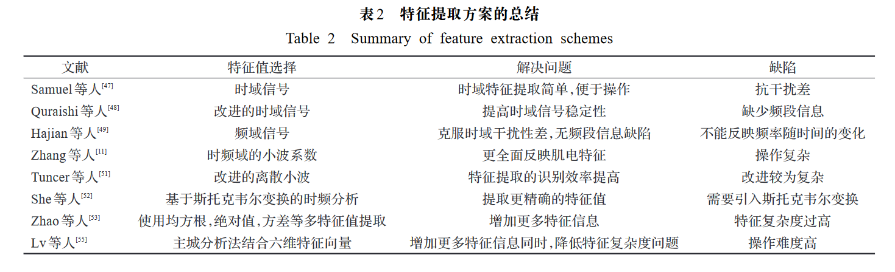

**预测模型的分类和应用**

- 传统机器学习分类算法具备`识别效率高和相对易改进`等优点从而备受研究者关注。随着肢体特征维数以及分类动作数据集增多时，往往需要对预测模型进行增强和优化，这需要耗费大量精力，在研究轻量级肢体动作分类预测时采用传统机器学习预测模型是不错的选择方案
- 深度学习的引入使得表面肌电下肢体动作识别预测节省了一定的成本，并且实际预测精度也是十分可观的。相比于传统模型和机器学习模型，当肢体动作分类较多时，深度学习模型更具优势但算法模型的设计难度较大，结合多模型算法可有效提升网络性能，但同时增加了网络计算量。对此可加强对轻量级网络的研究，以减小网络参数量，同时可以优化多特征值的复杂度从而以较低的成本完成识别预测

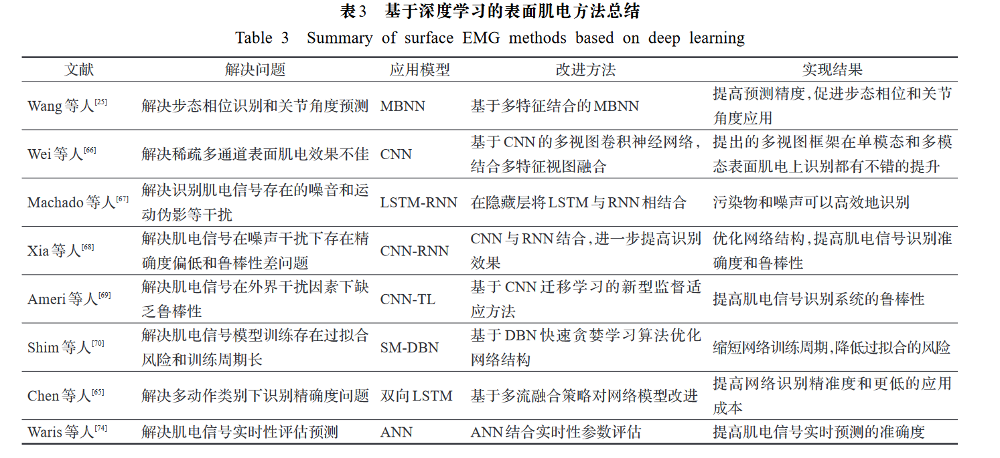

---