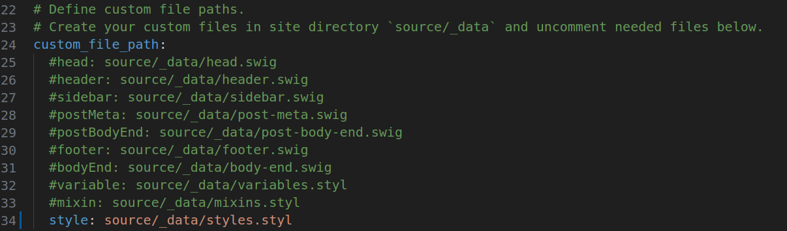

1. 将背景图片(`background.jpg`)放到**主题目录**的`source/images`目录下
2. 修改**<span style="background-color: yellow;">站点配置文件</span>**



3. 在**站点目录**的`source/_data`目录下新建`styles.styl`文件并添加以下代码块

```css
body {
	background:url(/images/background.jpg);
 	background-repeat: no-repeat;
    	background-attachment: fixed;  //是否滚动,fixed固定
    	background-size: cover;        //填充
    	background-position: center;
}
```

4. 使用`Ctrl/Shift + F5`重新加载页面即可

这应该是正常的键盘音把
