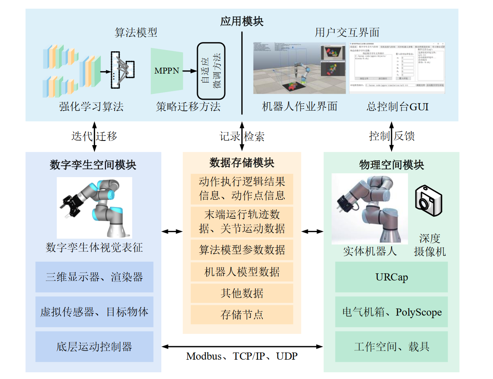

# 基于数字孪生的工业机器人运动控制

数字孪生模型建立：

- 工业机器人在实际场景中生成数据量大和管理不便

方案：

单任务学习：

- 针对智能制造中非结构化场景下的抓取任务，硬编码和示教方法存在低泛化性和高成本的问题

方案：在数字孪生空间中利用深度强化学习探索并学习动作策略，实现高效的抓取和推动协同控制

 

多任务学习（策略迁移到现实环境）：

- 数字孪生空间和现实环境的物体运动误差，数字孪生空间中训练的网络需要再次进行调整

- 直接控制工业机器人与现实环境中的进行单步交互并微调网络，耗费成本较高且安全风险较大

方案：基于图神经网络构建物体运动传播预测网络对推动效果预测，然后使用基于差分进化的自适应微调方法对推动策略进行迁移

# 面向智能制造的数字孪生工厂构建方法与应用

